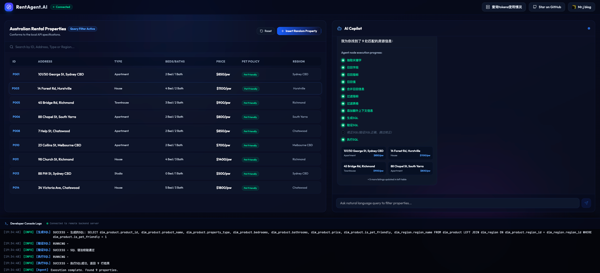
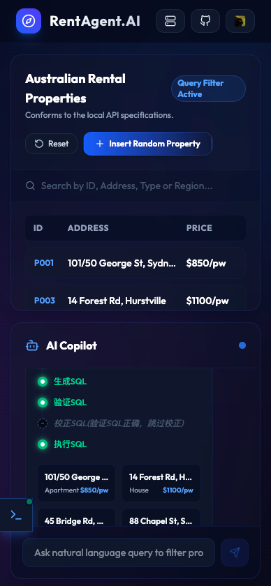

# RentAgent.AI

访问地址: [https://rent-agent-fronted.vercel.app/](https://rent-agent-fronted.vercel.app/)

基于 AI 驱动的轻量级澳洲房源智能分析与检索系统，致力将复杂的自然语言选房需求转化为精准的房源数据展现。

## 工作流程
1. **输入**：用户输入自然语言选房需求（例如：“帮我找一下价格在 500 到 600 的房子，且能养宠物的”）。
2. **理解与规划**：AI Agent (由 LangGraph 驱动的后端) 接收需求，通过 10 个完整的智能处理节点进行链路推理与决策决策：
   * 抽取关键字 ➔ 召回字段 ➔ 召回指标 ➔ 召回值 ➔ 合并召回信息 ➔ 过滤指标 ➔ 过滤表格 ➔ 添加额外上下文信息 ➔ 生成SQL ➔ 验证SQL ➔ 校正SQL(验证不通过时执行) ➔ 执行SQL
3. **输出**：前端实时展现工作流执行日志（Developer Console Logs）与查询到的澳洲房源卡片/列表，直观呈现数据指标（KPI卡片）以及 Token 消耗审计。

## 技术栈
| 分类 | 选型 | 说明 |
| :--- | :--- | :--- |
| **框架** | React 18 + Vite 5 | 现代化前端工程构建 & 极速热更新 |
| **样式** | Tailwind CSS v4 | 现代 Web3 风格，深色渐变与玻璃态微光质感 |
| **AI 代理后端** | LangGraph + FastAPI | 实现高度智能的 SQL 生成与自愈逻辑 (远程服务器部署) |
| **图标** | Lucide React | 提供一致性高的高品质图标集 |
| **数据监控** | Vercel Web Analytics | 实时跟踪并记录网页访问量及转化数据 |

## 核心技术要点
- **实时执行状态追溯 (Developer Console Logs)**：前端内建仿真开发控制台，记录并滚动显示 LangGraph 后端各个节点的执行轨迹与状态反馈，方便分析流程。
- **全平台自适应响应式设计 (Responsive Layout)**：
  - **桌面端**：沉浸式多栏 Dashboard，房源列表与 AI 助手左右分屏，保持工作流饱满。
  - **移动端**：布局自动流式向下堆叠，智能隐藏次要表格列，并配备一键开启控制台的悬浮按钮 (FAB)，结合物理阻尼滑入与淡入遮罩动效，完美适配小屏阅读。
- **多维度统计与 Token 消耗审计**：自动统计当前符合筛选条件的房源数据（包括平均租金、平均租约、总营收流水等 KPI），并集成明细弹窗，详尽展示每个智能节点所使用的 LLM 模型、输入/输出 Token 数量、预计折算费用等。
- **配置一致的接口路由代理**：配置 Vite Proxy（本地开发）与 vercel.json rewrite（生产部署），将所有 API 路由收归为相对路径 /api，确保前后端分离模式下无 CORS 跨域困扰。

---
**快速开始**：`npm install && npm run dev`
